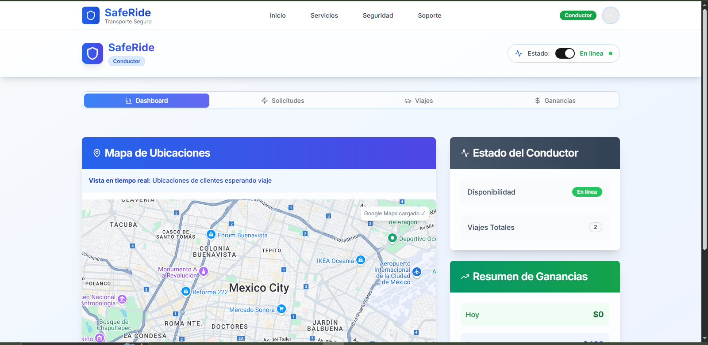

# Saferide-web

This project is a web application for a transportation service, built with Next.js and a variety of modern technologies to deliver a smooth and robust user experience.

# still in development


# Characteristics

- **User Authentication:** Login and registration management.
- **Dashboards:** Separate interfaces for drivers and passengers.
- **Maps Integration:** Uses Google Maps for route viewing and tracking.
- **Real-Time Communication:** Chat features and trip status notifications.
- **Reusable Components:** Developed with a UI component library for consistency and efficiency.

## Technologies Used

Here are the main technologies and libraries used in this project:

- **Next.js**
  [](https://nextjs.org/)

- **React**
  [](https://react.dev/)

- **TypeScript**
  [](https://www.typescriptlang.org/)

- **Tailwind CSS**
  [](https://tailwindcss.com/)

- **Supabase**
  [](https://supabase.io/)

- **Firebase**
  [](https://firebase.google.com/)

- **Radix UI**
  [](https://www.radix-ui.com/)

- **Google Maps JavaScript API Loader**
  [](https://developers.google.com/maps/documentation/javascript/)

- **Zod**
  [](https://zod.dev/)

- **React Hook Form**
  [](https://react-hook-form.com/)

- **Lucide React**
  [](https://lucide.dev/)

- **Sonner**
  [](https://sonner.emilkowalski.no/)

- **Recharts**
  [](https://recharts.org/en-US/)

# Installation and Use

To configure and run the project locally, follow these steps:

1.  **Clone repo:**
    ```bash
    git clone [URL_DEL_REPOSITORIO]
    cd Saferide-web
    ```

2.  **Install dependen:**
    ```bash
    npm install
    # o si usas pnpm
    pnpm install
    ```

3.  **Configure environment variables:**
    Create a `.env` file in the project root and add your environment variables (e.g., API keys for Supabase, Firebase, and Google Maps)

4.  **Run app:**
    ```bash
    npm run dev
    # o si usas pnpm
    pnpm dev
    ```

    server will be running `http://localhost:3000`.


# Contribution

Contributions are welcome! Please open an issue or submit a pull request with your improvements.

# License

This project is licensed under the [MIT](https://opensource.org/licenses/MIT). (Or the applicable license)

# flowchart

.png) 


## Screenshots
# root-1
  

# root-2 
  

# root-3
  

# Dashboard
  

# Dashboard-pass
  

# Dashboard-driver
  
